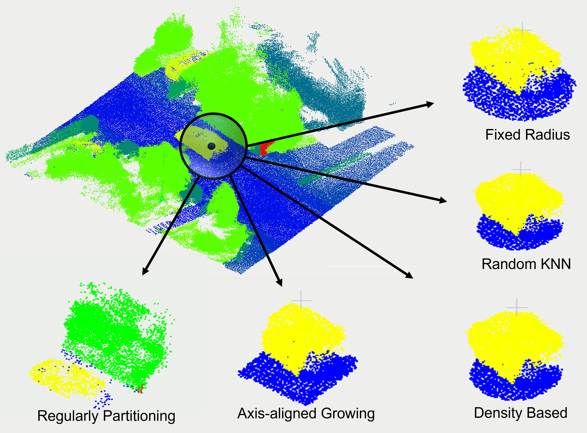

# Data Preparation Impact on Semantic Segmentation of 3D Mobile LiDAR Point Clouds Using Deep Neural Networks
**[Paper](https://www.mdpi.com/2072-4292/15/4/982)**



# Installing pre-requisites:

* Install `python` --This repo is tested with `{3.8}`
* Install `torch` --This repo is tested with `{1.5.0}` and `cuda 10.2`
* Install dependencies: `pip3 install -r requirements.txt`
* Compile the C++ extension modules for python located in `./KPConv/cpp_wrappers`. Open a terminal in this folder, and run:

          sh compile_wrappers.sh

# Downloading Datasets

Download [KITTI-360](https://www.cvlibs.net/datasets/kitti-360/user_login.php) inside the directory ```./Datasets/KITTI-360```. The directory structure should be:
```
./
└── Datasets/
    └── KITTI360
        └── train
          └── sequences
            ├── 00/           
            │   ├── {start_frame:0>10}_{end_frame:0>10}.ply
                └── ...
        └── validation
            └── sequences
                ├── 00/
                │   ├── {start_frame:0>10}_{end_frame:0>10}.ply
                    └── ...
        └── test
            └── sequences
                ├── 08/
                │   ├── {start_frame:0>10}_{end_frame:0>10}.ply
                |   └── ...
                ├── 18/
                │   ├── {start_frame:0>10}_{end_frame:0>10}.ply
                    └── ...
```

# Data Preparation
First, we need to prepare large point clouds of KITTI-360 for the input of the networks. Choose one of the proposed methods and run the related following to generate the sampled point clouds:

* Fixed Radius:
```
python3 ./DataPre/fr_threads.py --path ./Datasets/KITTI-360/train --split train`
python3 ./DataPre/fr_threads.py --path ./Datasets/KITTI-360/validation --split validation`
```
* Random KNN:
```
python3 ./DataPre/rknn_threads.py --path ./Datasets/KITTI-360/train --split train`
python3 ./DataPre/rknn_threads.py --path ./Datasets/KITTI-360/validation--split validation`
```
* Density Based:
```
python3 ./DataPre/db_main.py --path ./Datasets/KITTI-360/train --split train`
python3 ./DataPre/db_main.py --path ./Datasets/KITTI-360/validation --split validation`
```
* Axis-alined Growing:
```
python3 ./DataPre/aag_threads.py --path ./Datasets/KITTI-360/train --split train`
python3 ./DataPre/aag_threads.py --path ./Datasets/KITTI-360/validation --split validation`
```
# PointNet++
Run the following to train and test with PointNet++:
```
python3 ./Pointnet2/train_pointnet2.py --data-dir ./Datasets/KITTI-360/rknn --epochs 100 --batch-size 32
python3 ./Pointnet2/inference.py --data-dir ./Datasets/KITTI-360/rknn --trained-epoch 100 --batch-size 32
```
# KPConv
Run the following to train and test with KPConv:
```
python3 ./KPConv/train_AggData.py --data-dir ./Datasets/KITTI-360/rknn --epochs 100 
```
